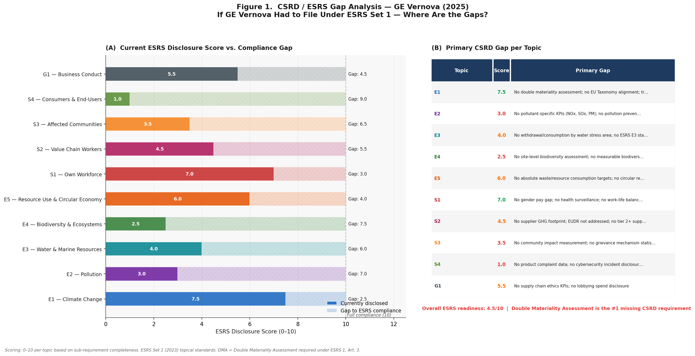
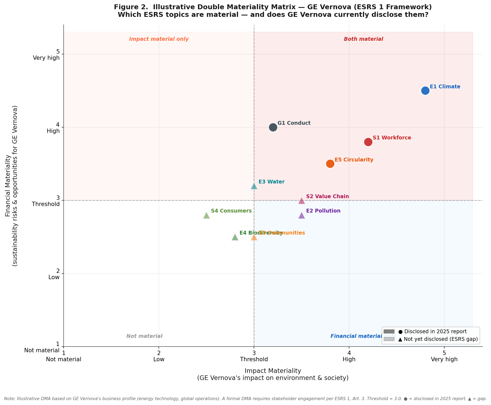
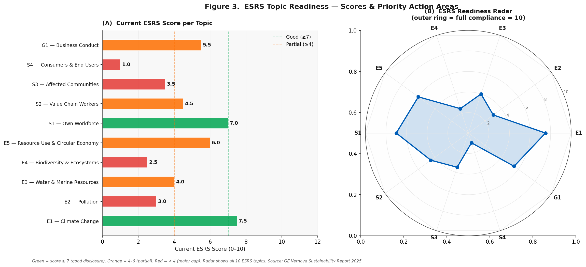

# GE Vernova — CSRD / ESRS Gap Analysis & Double Materiality Assessment

A Python analysis examining where GE Vernova stands against CSRD/ESRS reporting requirements. The project maps what GE Vernova currently discloses against the ESRS Set 1 topical standards (E1–E5, S1–S4, G1) and identifies the gaps — framed as: *if GE Vernova had to file under the simplified ESRS, where are the missing disclosures?*

Data based on GE Vernova Sustainability Report 2025.

---

## What it covers

- Topic-by-topic ESRS disclosure scoring (0–10 per topic)
- Gap analysis showing what is disclosed vs what CSRD requires
- Illustrative Double Materiality Assessment (impact + financial dimensions)
- ESRS readiness radar chart across all 10 topics
- Excel export with full gap breakdown, DMA matrix, and methodology

---

## Key Findings

| Finding | Detail |
|---------|--------|
| Overall ESRS readiness | **4.5 / 10** |
| Strongest topic | E1 Climate Change — 7.5/10 |
| Weakest topic | S4 Consumers & End-Users — 1.0/10 |
| Topics with gap > 5 | 6 out of 10 |
| Both-material topics | 6 out of 10 (impact + financial ≥ 3.0) |
| #1 missing requirement | **Double Materiality Assessment (ESRS 1, Art. 3)** |

---

## ESRS Topic Scores

| Topic | Current Score | Gap | Priority |
|-------|--------------|-----|----------|
| E1 — Climate Change | 7.5/10 | 2.5 | High |
| E2 — Pollution | 3.0/10 | 7.0 | Medium |
| E3 — Water & Marine | 4.0/10 | 6.0 | Medium |
| E4 — Biodiversity | 2.5/10 | 7.5 | Low |
| E5 — Resource Use | 6.0/10 | 4.0 | Medium |
| S1 — Own Workforce | 7.0/10 | 3.0 | High |
| S2 — Value Chain Workers | 4.5/10 | 5.5 | Medium |
| S3 — Affected Communities | 3.5/10 | 6.5 | Low |
| S4 — Consumers & End-Users | 1.0/10 | 9.0 | Low |
| G1 — Business Conduct | 5.5/10 | 4.5 | Medium |

---

## Figures

### Figure 1 — ESRS Gap Analysis


### Figure 2 — Double Materiality Matrix


### Figure 3 — ESRS Readiness Radar


---

## Data Source

| Field | Detail |
|-------|--------|
| Source | GE Vernova Sustainability Report 2025 |
| Standard | ESRS Set 1 (2023) — European Sustainability Reporting Standards |
| Regulation | CSRD (EU) 2022/2464 |
| DMA reference | ESRS 1, Art. 3 — Double Materiality Assessment |
| Current frameworks | GRI, SASB, TCFD, UN SDGs |

---

## How to Run

```bash
pip install pandas matplotlib openpyxl numpy

# Open in Spyder and press F5
# or from terminal:
python gev_csrd_gap.py
```

Figures and Excel saved to `output/`.

---

## Project Structure

```
gev-csrd-esrs-gap-analysis/
├── gev_csrd_gap.py
├── requirements.txt
├── README.md
└── .gitignore
```

---

## Methodology

| Item | Detail |
|------|--------|
| Standard | ESRS Set 1 (2023), CSRD (EU) 2022/2464 |
| DMA threshold | Score ≥ 3.0 on impact or financial dimension |
| Scoring scale | 0 = not disclosed, 5 = partial, 10 = full ESRS compliance |
| DMA note | Illustrative assessment — formal DMA requires stakeholder engagement per ESRS 1 Art. 3 |
